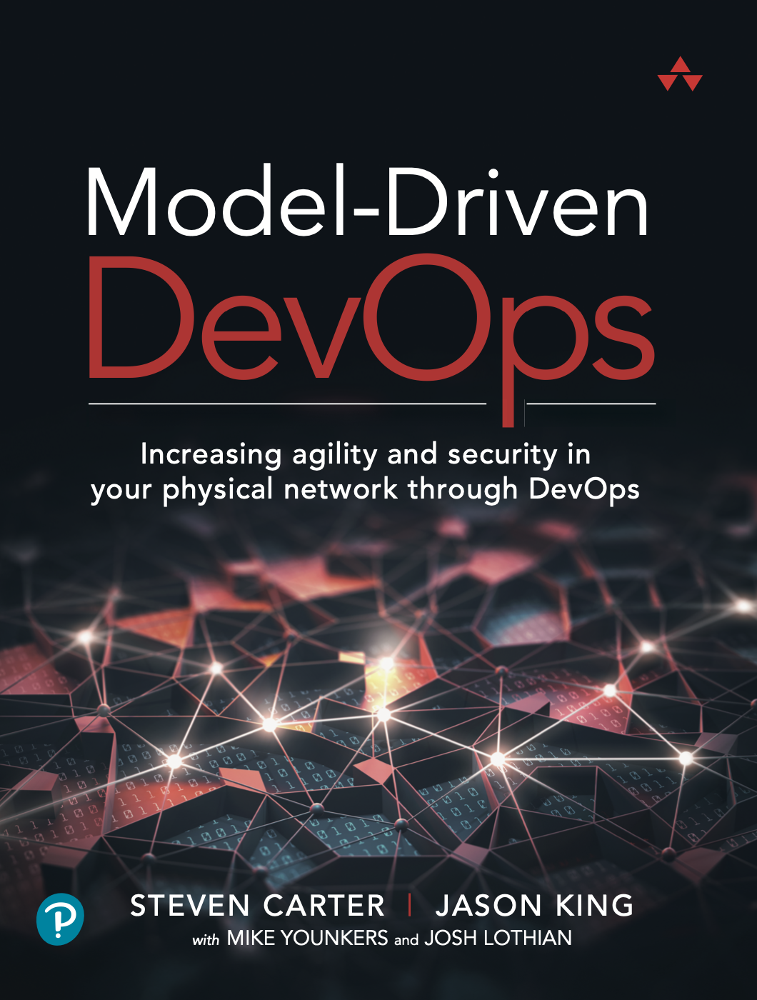

# DEVWKS-2870 Hands On With Model-Driven DevOps

In this workshop you will get hands on experience with the Model-Driven DevOps framework. You will get experience with data models, programmable infrastructure, controller platforms, version control, sources-of-truth and workflow engines. The goal is to illustrate the business outcomes that can be achieved with DevOps when applied to network infrastructure. Many people talk about the benefits of DevOps but there are few places to see it in action, so come see for yourself how it can transform the operation of your network infrastructure.

## What is Model-Driven DevOps?

Model-Driven Devops (MDD) is an IaC approach to automating physical infrastructure that focuses on data organization and movement into the network in a way that seeks to treat the network the same as other parts of the infrastructure.  It focuses on using industry standard tools and DevOps methodologies, implemented as a CI/CD pipeline, to break down silos between network operations and the rest of the infrastructure.  For example, this is a common flow in Cloud Operations:

Key to this flow is that all the data (Source of Truth) needed to configure the infrastructure is in the data file (CloudFormation Template).  Also, this is not a programmatic approach.  If you want to configure something different, you add data to the Source of Truth as opposed to writing another Ansible playbook or Python script.  We firmly believe that most network operators should not need to become programmers; however, they will have to learn a new skillset around data models and data manipulation.

When fully implemented, MDD requires a similar skillset to cloud operations. That is, when a network operator wants to configure, validate, or test something new, they just need to know how to add data to the Source of Truth and manipulate schemas. Furthermore, MDD can fit into existing CI/CD pipelines as opposed to needing to operate the network infrastructure differently. This allows for a de-siloization of IT making it possible to leverage developers and DevOps Engineers across application development, cloud operations, and network operations. This is possible because the MDD pipeline looks the same as any other code (or IaC) pipeline:

This workflow allows for a group of network engineers and network operators to collaborate on a change, test that change, get approvals, then push that change into the production network.  MDD's testing methodologies include "linting" the configuration data for typos, validating the configuration data for anything that would violate organization norms or create vulnerabilities, and then testing the result of that change in a network before deployment:

The goal is to find bad configurations *before* they are pushed into the network.

## MDD Reference implementation

In this workshop you will be using the [MDD reference implementation](https://github.com/model-driven-devops/mdd). The reference implementation is a specific implementation of the MDD concepts layed out in the book [Model-Driven Devops](www.informit.com/MDD). The reference implementation uses Cisco Modeling Labs to provision the topology, Ansible as the workflow engine, Cisco Network Services Orchestrator (NSO) as the platform and GitLab for version control and CI.

Shown below is the topology you will be working with during the workshop.  It is a typical HQ/branch architecture with L3 VPN in the WAN, rendundancy at the HQ site, and NAT at the ISP edge.

Each pod has it's own topology running in a Cisco Modeling Labs instance in AWS.

## Workshop Exercises

These exercises will help you get hands-on experience with different aspects of the reference implementation. You will begin by getting familiar with the data and Ansible playbooks in Visual Studio Code and finish with the fully implemented pipeline in GitLab.

* [Initial Setup](exercises/initial-setup.md#initial-setup)
* [Exploring the Inventory](exercises/explore-inventory.md#exploring-the-inventory)
* [Exploring the Data](exercises/explore-data.md#exploring-the-data)
* [Data Validation](exercises/data-validation.md#data-validation)
* [Pushing the Data](exercises/push-data.md#pushing-data)
* [State Checking](exercises/check-state.md#state-checking)

# extras

This is the companion repository for the book ["Model-Driven DevOps: Increasing agility and security in your physical network through DevOps"](https://www.informit.com/store/model-driven-devops-increasing-agility-and-security-9780137644674)
([Amazon](https://www.amazon.com/Model-driven-Devops-Increasing-Security-Physical/dp/0137644671/ref=sr_1_1?crid=1X8MTIAXRKLMI&keywords=model-driven+devops&qid=1650992113&sprefix=model-driven+devop%2Caps%2C202&sr=8-1)).  It presents the code and a set
of exercises that implements and demonstrates the concepts in the book.  In this repo, you are encouraged to use and contribute to
the code, submit [issues](https://github.com/model-driven-devops/mdd/issues) for problems and feature requests, and start/participate in
[discussions](https://github.com/model-driven-devops/mdd/discussions).