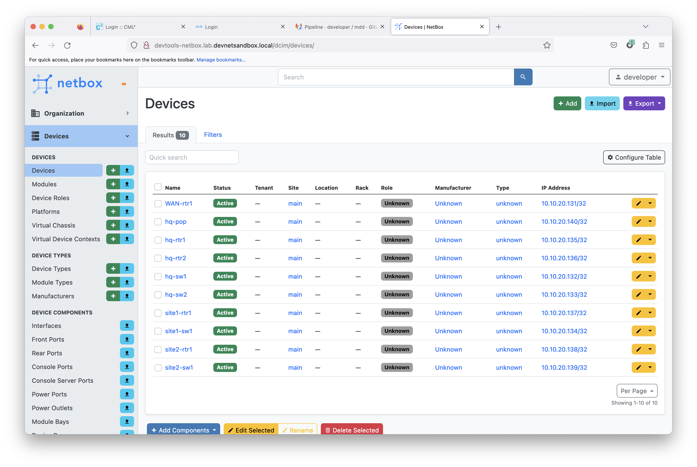
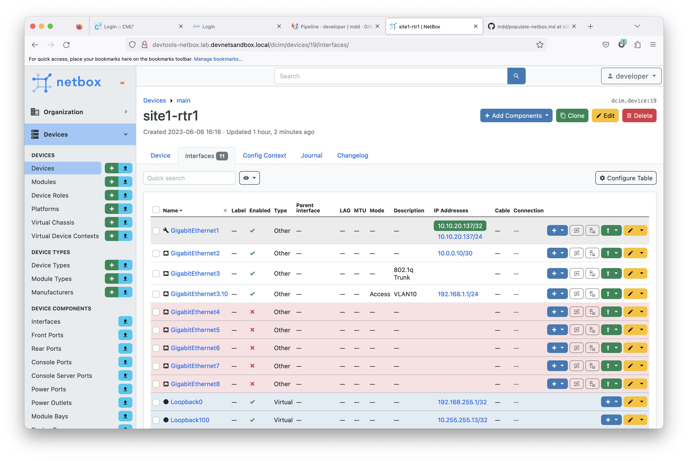
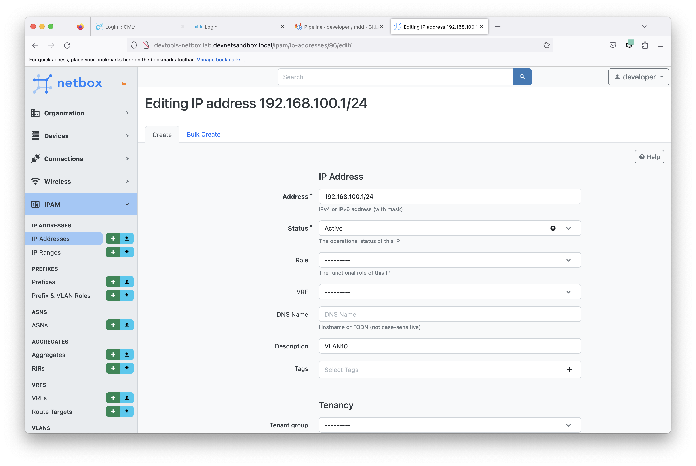

# Populating NetBox

In this exercise you will populate the NetBox database from the NSO CDB.  Sometimes it is preferrable to have certain data stored in a database oriented tool such as NetBox rather than YAML stored in git.  Typical source of truth items that we might store in NetBox are device, interface and IP information.  Let's get started!

In Visual Studio Code, set the required environment variables to tell the playbooks about NetBox.

```
export NETBOX_API=http://devtools-netbox.lab.devnetsandbox.local/
export NETBOX_TOKEN=0123456789abcdef0123456789abcdef01234567
```

Populate the basic information NetBox will need to create devices (device types, etc.)

```
ansible-playbook ciscops.mdd.netbox_init
```

Update the devices in NetBox based on the Ansible inventory.

```
ansible-playbook ciscops.mdd.inventory_update_netbox
```

Now browse to the NetBox UI at http://devtools-netbox.lab.devnetsandbox.local and login with the "developer" credentials.  Verify that we have the reference architecture devices populated.



And finally, populate all of the interface, IP address and VLAN information from the NSO CDB.

```
ansible-playbook ciscops.mdd.nso_update_netbox
```

In the NetBox UI, verify that we have interface and IP information populated.



> Note: this proecess will take several minutes

Remove all interface data from the mdd-data directory.  We are going to collect this information from NetBox now.

```
find mdd-data -name "oc-interfaces.yml" -type f -delete
```

Run the show playbook to output the OC data for site1-rtr1 and verify that the IP address shown for GigabitEthernet3.10 matches what is in NetBox.

```
ansible-playbook ciscops.mdd.show --limit site1-rtr1
```

> Note: even after we removed all interface data from the mdd-data directory, hq-rtr1 still has interface data populated in the show output.  This is now coming from Netbox.

Click on the IP address of GigabitEthernet3.10 and click "Edit" in the upper right corner.  Change the IP address to `192.168.100.1/24`.  Scroll down and click "Save".



Run the show playbook again and verify that we are picking up the changed IP address from NetBox.

```
ansible-playbook ciscops.mdd.show --limit site1-rtr1
```

Congratulations.  You have now successfully integrated NetBox as an additional source of truth.  To return to using YAML in Git as your source of truth for interface data unset the Netbox environment variables and restore the oc-interface.yml files.

```
unset NETBOX_API
unset NETBOX_TOKEN
git restore .
```

[Home](../README.md#workshop-exercises) | [Previous](cicd.md#cicd)
